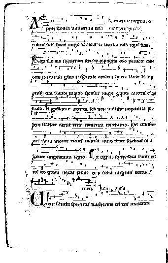
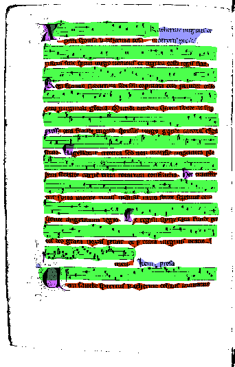

# OMMR4all-layout-analysis on historical handwritten music documents

## Prerequisites
Dependencies for the project are located in requirement.txt. 
Major Dependencies are:
* numpy
* scipy
* pillow
* opencv

## Installing

This projects requires the line detection of https://gitlab2.informatik.uni-wuerzburg.de/OMMR4all/ommr4all-line-detection
to be installed locally.
 * Clone the line segmentation repository `git clone https://gitlab2.informatik.uni-wuerzburg.de/OMMR4all/ommr4all-line-detection`
 * (Optional but recommended) Activate your virtual environment 
   (adapt to your path): `source venv/bin/activate`
 * install line segmentation `cd page-ommr4all-line-detection && python setup.py install`
 * Since the line detection requires the Pixel classifier of CWick: https://gitlab2.informatik.uni-wuerzburg.de/chw71yx/page-segmentation it is recommend to install it
 * Clone the page segmentation repository `git clone https://gitlab2.informatik.uni-wuerzburg.de/chw71yx/page-segmentation`
 * install page segmentation `cd page-segmentation && python setup.py install`
 * clone the layout analysis `git clone https://gitlab2.informatik.uni-wuerzburg.de/OMMR4all/ommr4all-layout-analysis`
 * install the specific requirements of layout analysis `cd ommr4all-layout-analysis && pip install -r requirements.txt` or `cd ommr4all-layout-analysis && python setup.py install` to install the provided scripts, too

 * the line analysis is installed

 
 ## Command line interface
 
 If you simply want to use the tool to your images you can use the scripts provided by the tool.
 
 Note that you have to activate the virtual environment if used during the installation in order to make the command line scripts available.
 You can segment the regions in the image by calling:
 
 `layout-analysis-predict --gray your_gray_scale_images.*.png`
 
Note that there are several important and optional parameters to adjust and enhance the prediction.

For a full list type `layout-analysis-predict --help` 

## Example

Input             |  Predicted Lines
:-------------------------:|:-------------------------:|
 | 
 
 ## Authors
 * Alexander Hartelt
 * Christoph Wick
 